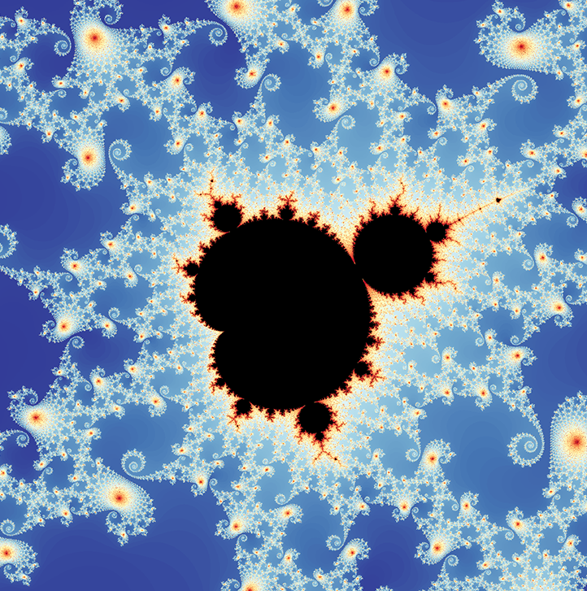

# mandelExplorer

R package allowing some exploration of the Mandelbrot fractal set using

1.  A Shiny app for exploring the Mandelbrot set interactively (function `mandel()`)

2.  A function to create particular views at given resolution (function `mandelbrot()`)

3.  A function to create animated real-time zooms to a given location (function `zoom()`)

4.  A function to create animated Christmas cards, zooming in to one of 16 pre-set locations, playing an accompanying Christmas song (function `xmascard(i)` with `i` between 1 and 16) and saving each as a Christmas card to be printed if desired

5.  A function to play all 16 animated Christmas cards in a row, accompanied by selected gems like Feliz Navidad by Jose Feliciano, All I Want for Christmas Is You by Mariah Carey or We Wish You a Merry Christmas by The Chipmunks or The Smurfs (function `jukebox()`). Yes, Belgium doesn't have many famous people, but the little blue guys are among them, in case you didn't know!

## Installation

To run within an R session :

```{r}
install.packages("remotes")
library(remotes)
remotes::install_github("tomwenseleers/mandelExplorer", build_opts=c("--no-staged-install"))
library(mandelExplorer)
```

To start interactive Shiny-powered Mandelbrot explorer:

```{r}
mandel()
```


For particular view at given resolution:

```{r}
mandelbrot(xlims=c(-0.74877,-0.74872),
           ylims=c(0.065053,0.065103), 
           res=1920L,
           pal=2)
```



For a real-time animated zoom to a particular region (using fast `nativeRaster` graphics)

```{r}
zoom(xlims=c(-0.766032578179731,-0.766032578179529),     
     ylims=c(0.10086220543088,0.10086220543102),      
     pal=1, # palette: 1 to 4     
     gamma=1/8,     
     res=640L)
```

Real-time animated zoom to one of 16 randomly selected pre-defined locations `p`, using given palette (click to view video):

```{r}
p=sample.int(16,1);zoom(xlims=x[[p]], ylims=y[[p]], pal=1);print(p)
```

[](https://vimeo.com/783419550)

Animated Christmas card showing a real-time Mandelbrot fractal zoom to one of 16 pre-set locations (`p` = number between 1 and 16) & show "Merry Christmas" at the end, whilst playing a fitting Christmas song; the Christmas card is also exported as a PNG image, so you can print it as a Christmas card if desired :

`p=8; xmascard(p)`


Play all 16 pre-set Christmas cards in a row using :

`jukebox()`

The pre-set locations & palettes look like in the image below :


You can modify the song played with each Christmas card using argument `wav`, which allows you to choose one of 13 provided songs `i`, or point to the `wav` file of your choice :

`p=1; i=1; xmascard(p, wav=songs[[i]])`

The available songs are `i=`

1 = Feliz Navidad - Jose Feliciano

2 = We Wish You A Merry Christmas - The Chipmunks

3 = We Wish You A Merry Christmas - Smurfs

4 = We Wish You a Merry Christmas - Sesame Street

5 = Jingle Bells - Winnie the Pooh

6 = Jingle Bells (techno version)

7 = All I Want for Christmas for Is You - Mariah Carey

8 = Do They Know It's Christmas - Band Aid

9 = Happy Christmas (The War is Over) - John Lennon

10 = Last Christmas - Wham

11 = Auld Lang Syne - Scottish bagpipes

12 = Here Comes Santa Claus - Elvis

13 = Rockin Around the Christmas Tree - Brenda Lee

Analogously, you can use argument `png` to point to your custom `png` file with the Christmas or New Year's message of your choice, change `pal` to the colour palette of your liking (choice from `1` to `4`), you can change `res` to change the resolution (e.g. `500L` or `1000L`) and you can change `xlims` and `ylims` (each vectors of 2 numbers) to specify the location you would like to zoom in to. The WAV files are reproduced from <https://www.thewavsite.com/> under the noncommercial use clause of the [Digital Millennium Copyright Act of 1998](http://www.copyright.gov/legislation/dmca.pdf)]. If any artist believes their work has been included in error and would like to see it removed, I will do so upon request.

# Technical details

The actual [Mandelbrot set](https://en.wikipedia.org/wiki/Mandelbrot_set "Mandelbrot set") is calculated using optimized Rcpp code that uses [OpenMP multithreading and SIMD vectorized operations](https://stackoverflow.com/questions/48069990/multithreaded-simd-vectorized-mandelbrot-in-r-using-rcpp-openmp) (SIMD optimizations were provided by [Z boson](https://stackoverflow.com/users/2542702/z-boson)). The animated real-time zooms make use of the `nativeRaster` format of the R package `nara` (<https://github.com/coolbutuseless/nara>) to achieve decent framerates. Hence, this package forms a good demonstration to illustrate the use of OpenMP in Rcpp to speed up code and of fast `nativeRaster` graphics to achieve real-time animation at high framerates.

## Bugs

-   Zooming is eventually limited by numerical accuracy, so only relatively shallow zooms are supported at the moment ([deep zooms](https://www.youtube.com/watch?v=pCpLWbHVNhk) would require calculating the Mandelbrot set using perturbation methods, see [article here](http://www.science.eclipse.co.uk/sft_maths.pdf) and [post with some corrections of typos in that article here](https://math.stackexchange.com/questions/939270/perturbation-of-mandelbrot-set-fractal)).
